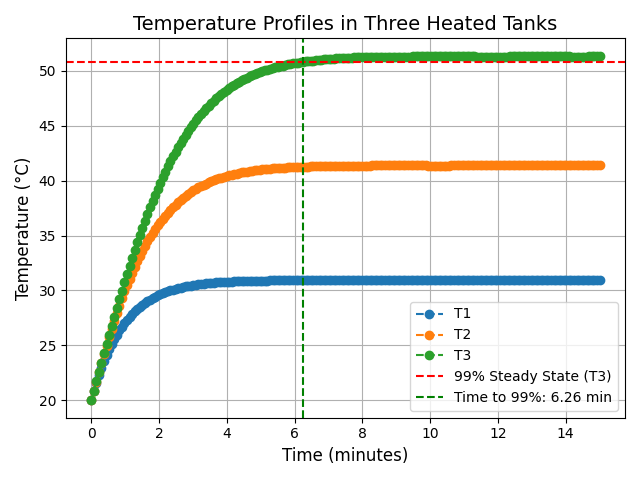
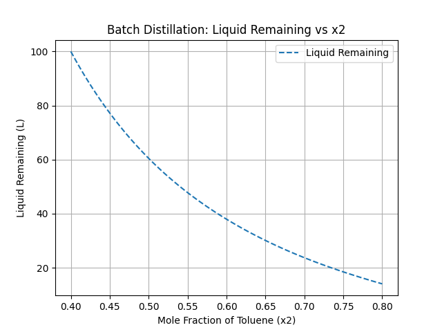

# Collection-Of-Numerical-Methods-In-ChE  

This repository contains a collection of representative problems in chemical engineering solved using numerical methods with Python.  
The problems are based on the document:  
**"A COLLECTION OF REPRESENTATIVE PROBLEMS IN CHEMICAL ENGINEERING FOR SOLUTION BY NUMERICAL METHODS"**  
This project aims to provide a practical learning resource for applying computational techniques to chemical engineering challenges.  
## List of Problems  


## How to Use This Repository  

The repository is organized as follows:  

- **`Main_Document/`**: Contains the original PDF file of the complete problem set.  
- **`Problem_X/` (e.g., `Problem_1/`)**: Each problem is stored in a separate folder containing:  
  - `solution.py`: The Python code solving the problem.  
  - `Problem_X.pdf`: The specific problem statement extracted from the main document.  

### Steps to Explore:  

1. Browse through the **Main_Document/** folder to view the full problem set.  
2. Navigate to the corresponding `Problem_X/` folder to access:  
   - Python solution (`solution.py`).  
   - The problem statement (`Problem_X.pdf`).  
3. Run the Python scripts locally to explore the solutions.

 ## Installation
1. Clone the repository:
   ```bash
   git clone https://github.com/sajjad-zeinali/Collection-Of-Numerical-Methods-In-ChE.git


---
### Problem 1: Molar Volume and Compressibility Factor  
Calculate the molar volume and compressibility factor of ammonia at different pressures and temperatures using the van der Waals equation.  

#### Results:  
- (a) At P = 56 atm and T = 450 K:  
  - Molar volume (V) = 0.5749 L/mol  
  - Compressibility factor (Z) = 0.8718  

- (b) At different reduced pressures (Pr):  
  - Pr = 1 → V = 0.2335 L/mol, Z = 0.7038  
  - Pr = 2 → V = 0.0773 L/mol, Z = 0.4658  
  - Pr = 4 → V = 0.0607 L/mol, Z = 0.7313  
  - Pr = 10 → V = 0.0509 L/mol, Z = 1.5334  
  - Pr = 20 → V = 0.0462 L/mol, Z = 2.7835  


---
### Problem 2: Steady State Material Balances on a Separation Train  
Solve the system of linear equations to determine the molar flow rates and compositions in a distillation separation train.  

#### Results:  
- (a) Molar flow rates of streams:  
  - D1 = 24.5152 mol/min  
  - D2 = 19.1136 mol/min  
  - B1 = 5.7248 mol/min  
  - B2 = 20.3601 mol/min  

- (b) Molar flow rates of streams:  
  - D = 30.2401 mol/min  
  - B = 39.4737 mol/min
---

### Problem 3: Vapor Pressure Data Representation by Polynomials and Equations  
Use various regression methods to model vapor pressure data for benzene versus temperature using polynomials, the Clausius-Clapeyron equation, and the Antoine equation.  

#### Results:  
- (a) Polynomial fit (degree 3):  
  - R² = 0.9996  

- (b) Linear fit (Clausius-Clapeyron equation):  
  - R² = 0.9915  

- (c) Model fit (Antoine equation):  
  - R² = 0.9997  


---

### Problem 4: Reaction Equilibrium for Multiple Gas Phase Reactions  
Solve the system of nonlinear algebraic equations for a gas-phase batch reactor at equilibrium, considering multiple reactions with known equilibrium constants.  

#### Results:  
- Concentrations at equilibrium:  
  - CA = 0.421 mol/L  
  - CB = 0.243 mol/L  
  - CC = 0.154 mol/L  
  - CD = 0.705 mol/L  
  - CX = 0.178 mol/L  
  - CY = 0.552 mol/L  
  - CZ = 0.374 mol/L  

- Equilibrium constants:  
  - KC1 = 1.06  
  - KC2 = 2.63  
  - KC3 = 5.00
---

### Problem 5: Terminal Velocity of Falling Particles  
Calculate the terminal velocity of coal particles falling in water under the influence of gravity and centrifugal acceleration.

#### Results:  
- Terminal velocity for gravity 9.81 m/s²:  
  - vt = 0.015787 m/s  

- Terminal velocity for gravity 294.20 m/s² (centrifugal separator):  
  - vt = 0.206023 m/s  


---

### Problem 6: Heat Exchange in a Series of Tanks  
This problem involves solving simultaneous first-order ordinary differential equations for a series of three tanks used to preheat an oil solution. The tanks are heated by steam, and the goal is to determine the steady-state temperatures and the time required for the third tank to reach 99% of its steady-state value during startup.

#### Results:  
- Steady-state temperature for T3:  
  - T3 = 51.29 °C  

- Time for T3 to reach 99% of steady-state value:  
  - 6.26 minutes  



---

### Problem 7: Diffusion with Chemical Reaction in a One Dimensional Slab  
This problem involves numerically solving a second-order ordinary differential equation for the diffusion and simultaneous first-order irreversible chemical reaction in a one-dimensional slab. The solution utilizes an ODE solver with a shooting technique and compares the numerical results with the analytical solution for concentration profiles.


---
### Problem 8: Binary Batch Distillation  
This problem involves calculating the amount of liquid remaining in a still during the batch distillation of a benzene (component 1) and toluene (component 2) mixture. Initially, there are 100 moles of liquid in the still, consisting of 60% benzene and 40% toluene by mole fraction. The goal is to determine the remaining liquid when the toluene concentration reaches 80% at a pressure of 1.2 atm.

#### Results:  
- Initial temperature:  
  - 95.59 °C  

- Final temperature:  
  - 108.57 °C  

- Remaining liquid at x2 = 0.8:  
  - 14.06 moles  



---
### Problem 9: Reversible, Exothermic, Gas Phase Reaction in a Catalytic Reactor  
This problem involves the design of a packed bed reactor for a first-order reversible gas-phase reaction with a pressure drop along the reactor length. The reaction occurs in the presence of a heat exchanger, and the system follows plug flow assumptions. The goal is to analyze conversion, pressure, temperature, and concentration profiles along the reactor.


---
### Problem 10: Dynamics of a Heated Tank with PI Temperature Control
This problem simulates the dynamics of a heated tank with a PI temperature controller. The system consists of a well-stirred tank, a heater, and a temperature controller. The objective is to maintain the tank's temperature at a set point despite disturbances in the inlet temperature.


---


✨ **Feel free to contribute, explore, or suggest improvements to make this repository even better!** ✨  

---  
 

